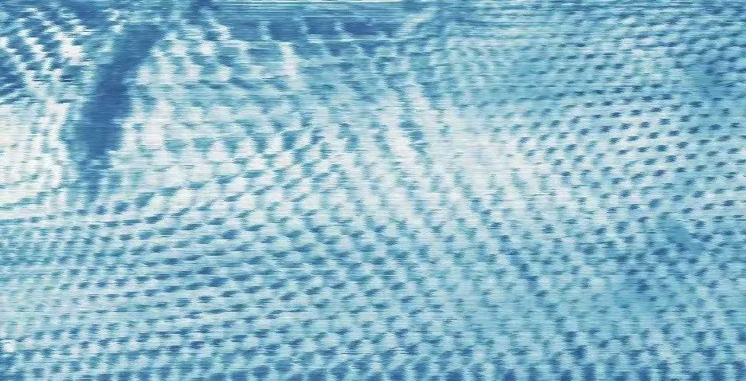

---
hide:
  - toc
---

  

# OU Hao (欧昊)

##### | 2D Materials | Moiré Systems | Electronics

##### Assistant professor, Department of Physics, Institute of Science Tokyo

---

### Research Interests

- 2D materials & heterostructures
- Moiré superlattice physics
- Electronic & optoelectronic devices

---

!!! note "Recent Updates"

    **2026.07.01** - Won the Best Poster Award on 2D Transition Metal Dichalcogenides 2026!

    **2026.06.01** - New co-authored research paper [published online](https://advanced.onlinelibrary.wiley.com/doi/full/10.1002/aelm.202400930) in *Advanced Electronic Materials*.

[View full timeline →](News&history.md)
---

### Contact

Email: 	ou[at]phys.sci.isct.ac.jp 

Lab link: [Hokoh (Jiang Pu) lab](https://sites.google.com/view/hokoh-lab/home?authuser=0), Institute of Science Tokyo